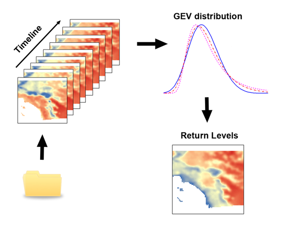
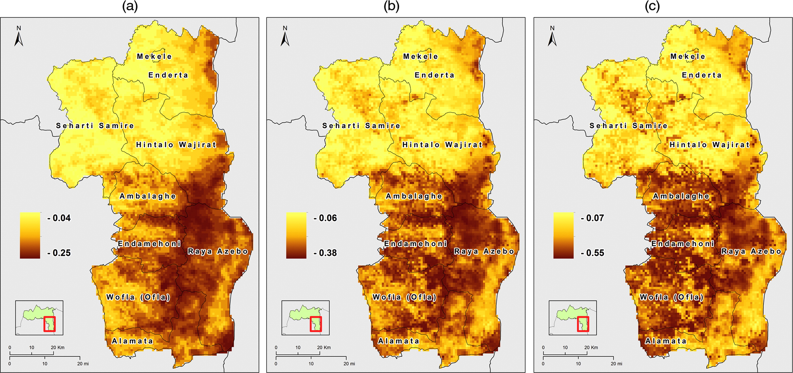

# Gridded Extremes R-ArcGIS Tools

Using Python as a medium to call R functionality within ArcGIS. The repository contains all the subfolders, scripts, and ArcGIS toolbox necessary to install and run the GriddedExtremes.tbx within ArcGIS (version 10 or later).
It is very important that you follow the guidelines in the *INSTALLDOC.docx* or *INSTALLDOC.pdf* files inside the [Doc](Doc) folder.

This custom ArcGIS toolbox only contains the block maxima/minima approach to extreme value analysis. 
Future versions may include tools such as exploratory ACF/PACF analysis or the peak-over-threshold (POT) approach to extreme values. 
The current tool assumes stationarity in the temporal sequence of values. Given a sequence of temporal raster images, this tool runs the block maxima (minima) approach in order to calculate return levels for the desired return period(s). 
The script tool uses external [R software](https://www.r-project.org/) routines for all calculations.

For more updated versions of this toolbox and script tool, please keep checking the newer CHANS tools [R-ArcGIS Bridge](https://r-arcgis.github.io/) repository.

## Software Dependencies

To install the Telecoupling Toolbox for ArcGIS, make sure to follow all the steps specified below.

* [R (2.15.0 or later)](https://www.r-project.org/)
* ArcGIS (10 or later)
* Python 2.7.x **(ArcGIS comes with Python, so no need to install a standalone version of Python!)**

**_NOTE: ArcGIS Pro has also NOT been tested yet! Python 2.7.x ships together with ArcGIS and is automatically installed with it. 
If possible, avoid installing multiple versions of Python on your system as it may create conflicts and errors. 
If you are using Anaconda, you may need additional settings to make sure you can run the tools smoothly. 
For more info, check [this website](https://pymorton.wordpress.com/2014/06/17/using-arcpy-with-anaconda/)._**)

## Credits and Contacts

Francesco Tonini: <ftonini84@gmail.com> 

## LICENSE

* Main script: [Apache 2.0](LICENSE)
* This toolbox depends on the R Statistical Computing Software:

© 2017 The [R Foundation for Statistical Computing](https://www.r-project.org/). R is free software and comes with ABSOLUTELY NO WARRANTY. See the [COPYRIGHTS](https://github.com/wch/r-source/blob/trunk/doc/COPYRIGHTS) file for details.

* This toolbox depends on [ESRI software](www.esri.com):

© 2017 ESRI. See the [Software License and Agreement](http://www.esri.com/legal/software-license) for details.
